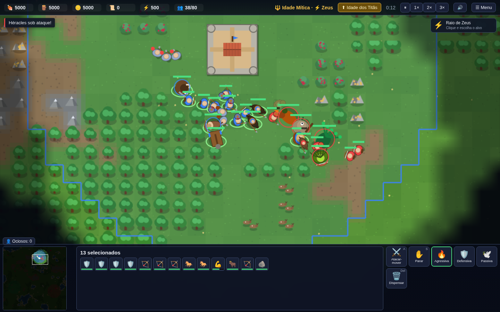

# Age of Earth

RTS que mistura **Rise of Nations** (Idades, fronteiras nacionais, atrito, linhas de pesquisa) com
**Age of Mythology** (deuses gregos, Favor, heróis, criaturas míticas, poderes divinos e Titãs).
Feito em TypeScript + PixiJS (WebGL), com simulação determinística pronta para multiplayer em lockstep,
e empacotável com Electron para a Steam.



## Jogar agora

```bash
npm install
npm run dev        # abre em http://localhost:5173
```

Versão otimizada: `npm run build` e `npm run preview`.

## Como jogar (resumo)
- Escolha um deus maior (Zeus, Poseidon ou Hades), o tamanho do mapa, quantos oponentes e a dificuldade.
- Cidadãos coletam Comida, Madeira e Ouro; rezam no Templo para gerar **Favor**; filósofos na Academia geram **Conhecimento**.
- Só é possível construir dentro das suas **fronteiras**; tropas inimigas dentro delas sofrem **atrito**.
- Avance de Idade no Centro Cívico e escolha um **deus menor** a cada Idade: cada um dá um poder divino, uma criatura mítica e tecnologias.
- Vença por **Conquista** (elimine todos) ou pela **Maravilha** (mantenha-a de pé por 6 minutos).
- `F1` mostra a ajuda; a tela de **atalhos** (menu ⚙ Opções) lista todas as teclas; `F2` abre a enciclopédia completa (unidades, edifícios, tecnologias, deuses).
- Opções (menu principal e menu da partida): volume, tela cheia (F11), tamanho da interface, qualidade de renderização, idioma (PT-BR/EN).

## Modos de jogo
- **Partida rápida**: você contra 1–3 IAs, todos contra todos, cooperativo (você + IA aliada) ou contra uma aliança.
- **Campanha** "A Sombra dos Titãs": prólogo em 3 missões com objetivos, diálogos e gatilhos (tutorial → cerco → corrida contra o Portal dos Titãs).
- **Modo Horda**: sobreviva a 20 ondas do Tártaro, solo ou em cooperativo online (todos no mesmo time).
- **Replays**: a última partida local fica gravada (só os comandos) e pode ser assistida no menu.
- **Multiplayer online** (lockstep determinístico, até 4 jogadores incluindo IAs, com times/co-op):

```bash
npm run relay            # servidor de retransmissão na porta 8787 (pode ficar em qualquer VPS)
npm run dev              # cada jogador abre o jogo, aba Multiplayer, mesmo servidor e mesma sala
```

Todos os clientes simulam a mesma partida e só trocam comandos; um hash periódico detecta dessincronizações. O lobby tem bate-papo, ping por jogador, remoção pelo anfitrião e atraso do lockstep ajustado à latência; na partida, `Enter` abre o bate-papo. Se alguém cair, a partida pausa e o jogador pode **reconectar** entrando na mesma sala com o mesmo nome (o anfitrião envia um instantâneo).

## Conteúdo
- 5 Idades, 3 deuses maiores, 9 deuses menores, 12 poderes divinos.
- 15 unidades humanas, 5 heróis, 13 criaturas míticas, 3 Titãs.
- 20 edifícios (incluindo 3 Maravilhas e o Portal dos Titãs), 60+ tecnologias.
- IA adversária com economia, expansão, pesquisa, ondas de ataque, defesa e poderes; 3 dificuldades.
- Mapas procedurais (3 tamanhos) com posições iniciais justas e gargalos alargados; névoa de guerra; minimapa; salvar/carregar (com exportar/importar arquivo); 22 conquistas.

## Desenvolvimento

```bash
npm test           # testes (vitest): dados, determinismo, pathfinding, simulação, regressões, cenários, lockstep
npm run typecheck  # TypeScript estrito
npm run smoke 20   # simula 20 minutos de IA x IA sem interface e imprime o resumo
npm run balance    # várias partidas IA x IA com sementes diferentes (balanceamento)
npx tsx scripts/missions.ts     # valida as missões da campanha sem interface
node scripts/playtest.mjs       # playtest automatizado no Chromium (requer `npm run preview` em outro terminal)
node scripts/playtest-mp.mjs    # dois navegadores em lockstep (requer preview + `npm run relay`)
node scripts/playtest-reconnect.mjs   # queda e reconexão de um jogador (requer preview + relay)
node scripts/playtest-options.mjs     # opções, atalhos, ajuda, pausa do menu
```

Estrutura: `src/core` (simulação, sem DOM) · `src/render` (PixiJS) · `src/ui` (HUD/menus) · `desktop/` (Electron/Steam) · `docs/` (design, Steam).

## Roteiro
Concluído: skirmish contra IA, times/co-op, multiplayer em lockstep via relay, prólogo da campanha, empacotamento Electron.
Concluído também: guarnição e portões, formações, IA "Muito difícil" e IAs aliadas coordenadas, idiomas PT-BR/EN, opções, reconexão e bate-papo online, caça a bugs automatizada (48 correções).
Próximos passos: editor de cenários e mapas fixos, mais missões da Titanomaquia, novos modos (Regicídio, Rei da Colina, Deathmatch), arte final e animações, música, Steam Networking Sockets e Workshop. Detalhes em `docs/ROADMAP.md`, `docs/DESIGN.md` e `docs/STEAM.md`.

## Licença
MIT.
